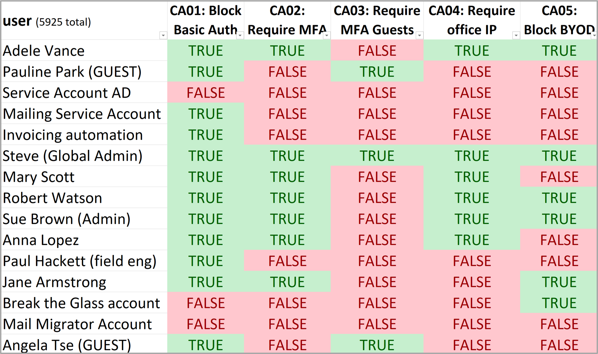

 

  <h3 align="center">Conditional Access Matrix</h3>

  

    By Jasper Baes
     
    <a href="https://github.com/jasperbaes/Conditional-Access-User-Matrix#projects">What and why</a>
    ·
    <a href="https://github.com/jasperbaes/Conditional-Access-User-Matrix/issues">Report Bug</a>
    ·
     <a href="https://www.jbaes.be/CAF">Conditional Access Framework</a>
  

## What and why

The Conditional Access Matrix is tool #3 in the <a href="https://www.jbaes.be/CAF">Conditional Access Framework</a>.

This script helps solve a frequent problem: the lack of visibility of which CA policies are applied on each users. These insights are essential in order to use Conditional Access to it’s full extend with the guarantee no users are forgotten about, or no misconfigurations are in place.

Generated excel:

What is offered:
- extract an Excel visualizing which CA policies are applied on each user
- filter in this table
- identify gaps and misconfigurations
- for documentation and compliance purposes
- easily and quickly answer questions like:
  - what accounts have MFA enabled/disabled?
  - what accounts are excluded form having a compliant device?
  - what accounts are allowed to use legacy auth?
  - ..

These insights are especially needed in larger or more complex environments.

## Installation

  
  
  

## Limitations
- Subgroups might not be fully evaluated
- Conditional Access policies scoped on users with Entra roles

## Contact

Jasper Baes (https://www.linkedin.com/in/jasper-baes)

## License

Please be aware that the Conditional Access Matrix code is intended solely for individual administrators' personal use. It is not licensed for use by organizations seeking financial gain. This restriction is in place to ensure the responsible and fair use of the tool. Admins are encouraged to leverage this code to enhance their own understanding and management within their respective environments, but any commercial or organizational profit-driven usage is strictly prohibited.

Thank you for respecting these usage terms and contributing to a fair and ethical software community. 

Jasper Baes (https://www.linkedin.com/in/jasper-baes)