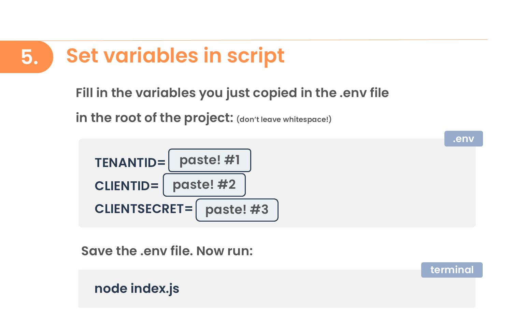

<br>
<p align="center">
  <a href="https://jbaes.be/CAB">
    
  </a>
  <h3 align="center">Conditional Access Impact Matrix</h3>
  <p align="center">
    By Jasper Baes
    <br />
    <a href="https://github.com/jasperbaes/Conditional-Access-Matrix#installation">Installation</a>
    ·
    <a href="https://github.com/jasperbaes/Conditional-Access-Matrix/issues">Report Bug</a>
    ·
     <a href="https://www.jbaes.be/CAB">Conditional Access Blueprint</a>
  </p>
</p>


The Conditional Access Impact Matrix is tool #3 in the <a href="https://www.jbaes.be/CAB">Conditional Access Blueprint</a>.

This script answers 2 major questions:
- what CA policies are applied to who?
- what is the user impact of my recent CA policy changes?


Output 1: excel matrix:


Output 2: impact changes:


Features:
- extract an Excel visualizing which CA policies are applied on each user
- filter in this table
- identify gaps and misconfigurations
- Predict user impact before enabling CA policies
- for documentation and compliance purposes
- easily and quickly answer questions like:
  - what accounts have MFA enabled/disabled?
  - what accounts are excluded form having a compliant device?
  - what accounts are allowed to use legacy auth?
  - ...
- visualize how recent CA changes impacted your users

## Usage

Examples:

```sh
node index.js
node index.js --include-report-only
node index.js --compare 2024-09-01-CA-Impact-Matrix.json
node index.js --compare 2024-09-01-CA-Impact-Matrix.json --include-report-only
node index.js --limit 100
node index.js --group <groupID>
node index.js --type member
node index.js --limit 10 --type guest
```


| Parameter           |               Description |
| ----------------- | --------------------------------------------------------------: |
| `--include-report-only` | Includes Conditional Access policies that are in the ‘report-only’ state  |
| `--compare <file.json>` | Compares the current output to a previously generated output specified by <file> |
| `-t` or `--type` | Specifies the type of accounts to include (options: `member` or `guest`)  |
| `-l` or `--limit` | Limits the number of users to the specified count  |
| `-g` or `--group` | Restricts the scope to members of the specified group  |

What running the script looks like:


## Installation

<a href="./assets/manual-1.png" target="_blank"></a> <br>
<a href="./assets/manual-2.png" target="_blank"></a> <br>
<a href="./assets/manual-3.png" target="_blank"></a> <br>


## Limitations
- Conditional Access policies scoped on users with Entra roles might not be evaluated

## Contact

Jasper Baes (https://www.linkedin.com/in/jasper-baes)

Discovered a bug or do you have an improvement? Create an <a href="https://github.com/jasperbaes/Conditional-Access-Matrix/issues">issue</a>.

## Release history

Release version numbers: YEAR.WEEK

- 2024.49
  - bugfix ([#7](https://github.com/jasperbaes/Conditional-Access-Matrix/issues/7))
  - implemented local caching (drastically improved execution speed)
  - added support for recursive groups ([#8](https://github.com/jasperbaes/Conditional-Access-Matrix/issues/8))
  - removed limit on user group membership reads (previously capped at 100)
- 2024.41
  - add 3 new parameters: limit, group and type
- 2024.40
  - updated installation guide
  - added .env template file
- 2024.39
  - added parameter for 'report-only' CA policies
  - bugfix ([#1](https://github.com/jasperbaes/Conditional-Access-Matrix/issues/1))
- 2024.38
  - initial release (open-source)

## License

Please be aware that the Conditional Access Impact Matrix code is intended solely for individual administrators' personal use. It is not licensed for use by organizations seeking financial gain. This restriction is in place to ensure the responsible and fair use of the tool. Admins are encouraged to leverage this code to enhance their own understanding and management within their respective environments, but any commercial or organizational profit-driven usage is strictly prohibited.

Thank you for respecting these usage terms and contributing to a fair and ethical software community. 

Jasper Baes (https://www.linkedin.com/in/jasper-baes)

Buy Me a Coffee (https://buymeacoffee.com/jasperbaes)